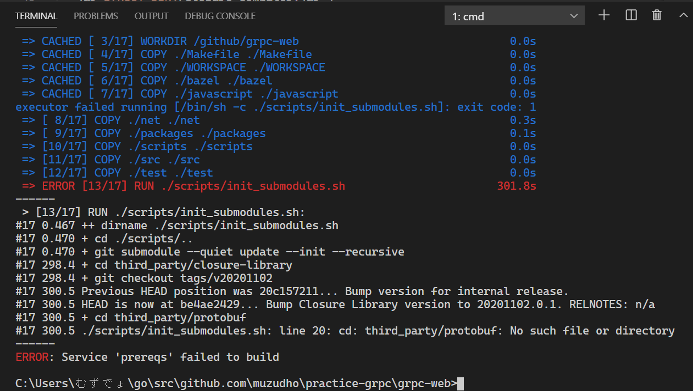

# practice-grpc

gRPCの練習（＾～＾）  

```shell
# もうやった（＾～＾）
go mod init
```

うーん、Dockerで環境作った方がいいのかだぜ（＾～＾）？  

[gRPC Web - Quick start](https://grpc.io/docs/platforms/web/quickstart/)  

```shell
git clone https://github.com/grpc/grpc-web
```

`grpc-web` というでかいフォルダーがでけたぜ（＾～＾）  

```shell
cd grpc-web

docker-compose pull

docker-compose up -d node-server envoy commonjs-client
```

  

もしかして、Windowsにダウンロードしたときにテキストファイルの改行が `\r\n` になってしまって  
DockerのLinuxにファイルを置いたときに `\r` が邪魔になったのかだぜ（＾～＾）？  
`CRLF` を `LF` に変えたろ（＾～＾）  

  

つら（＾～＾）  

```shell
cd ..
git submodule init
git submodule update
cd grpc-web
docker-compose pull

# WARNING: Some service image(s) must be built from source by running:
#     docker-compose build interop-client closure-client node-interop-server echo-server binary-client protoc-plugin prereqs grpcwebproxy java-interop-server ts-client

docker-compose build interop-client closure-client node-interop-server echo-server binary-client protoc-plugin prereqs grpcwebproxy java-interop-server ts-client

# docker-compose up -d node-server envoy commonjs-client
```

同じエラー（＾～＾）  
じゃあ Visual Studio Code を使っていることによる カレント・ディレクトリ の違いか（＾～＾）？  

```shell
# これでトップ・ディレクトリを grpc-web にしたれ（＾～＾）
code .

docker-compose up -d node-server envoy commonjs-client
```
