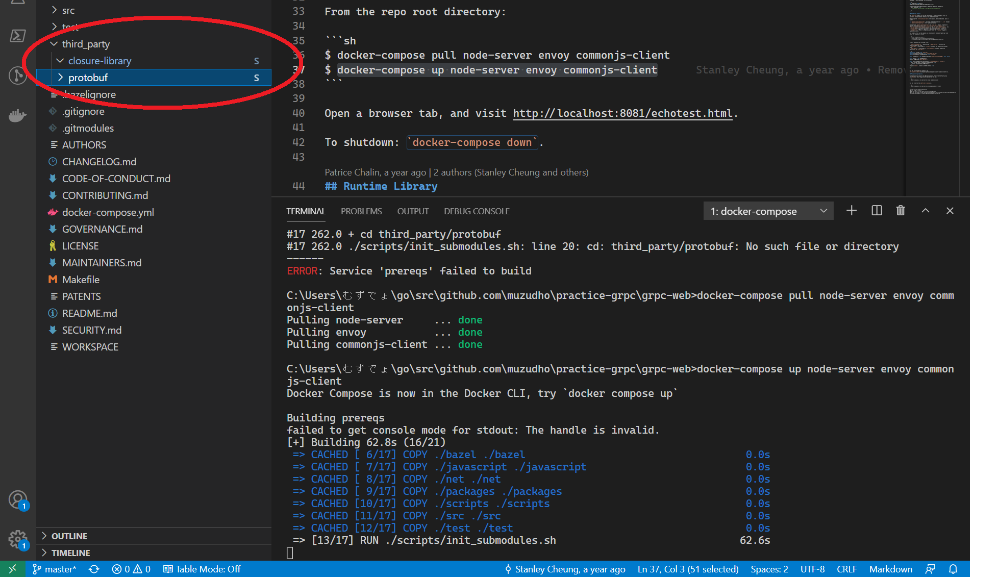
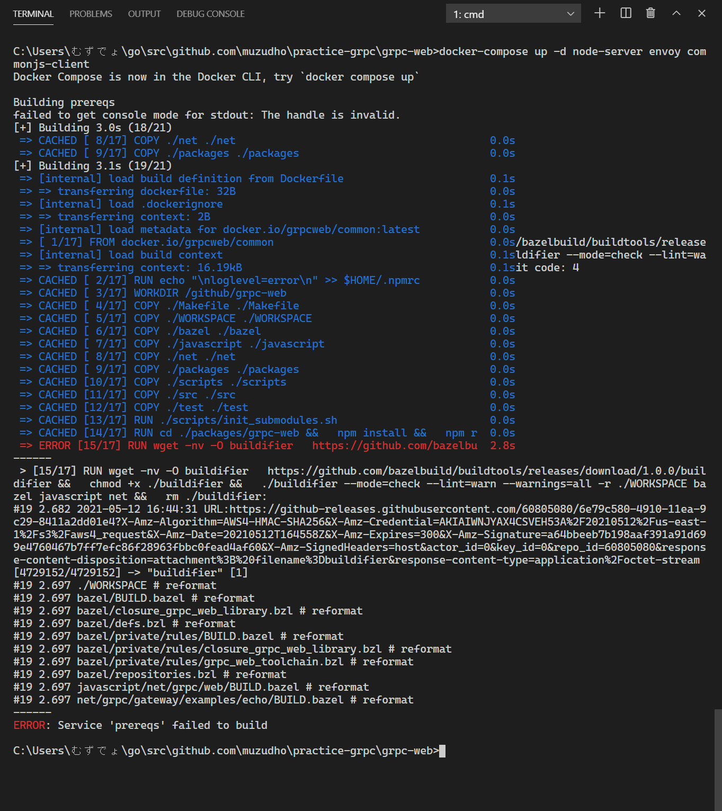
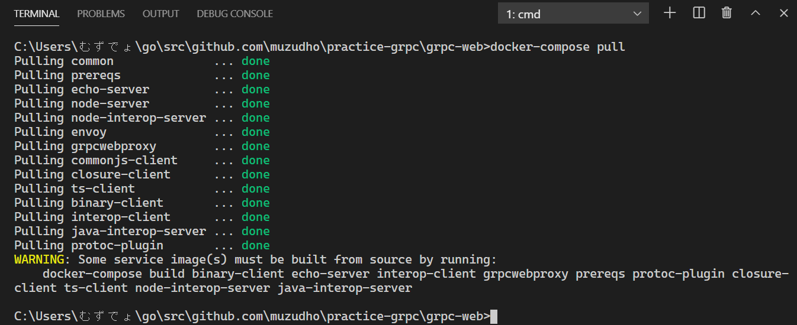

# practice-grpc

gRPCの練習（＾～＾）  

```shell
# もうやった（＾～＾）
go mod init
```

うーん、Dockerで環境作った方がいいのかだぜ（＾～＾）？  

[gRPC Web - Quick start](https://grpc.io/docs/platforms/web/quickstart/)  

```shell
git clone https://github.com/grpc/grpc-web
```

`grpc-web` というでかいフォルダーがでけたぜ（＾～＾）  

```shell
cd grpc-web

docker-compose pull

docker-compose up -d node-server envoy commonjs-client
```

  

もしかして、Windowsにダウンロードしたときにテキストファイルの改行が `\r\n` になってしまって  
DockerのLinuxにファイルを置いたときに `\r` が邪魔になったのかだぜ（＾～＾）？  
`CRLF` を `LF` に変えたろ（＾～＾）  

  

つら（＾～＾）  

```shell
cd ..
git submodule init
git submodule update
cd grpc-web
docker-compose pull

# WARNING: Some service image(s) must be built from source by running:
#     docker-compose build interop-client closure-client node-interop-server echo-server binary-client protoc-plugin prereqs grpcwebproxy java-interop-server ts-client

docker-compose build interop-client closure-client node-interop-server echo-server binary-client protoc-plugin prereqs grpcwebproxy java-interop-server ts-client

# docker-compose up -d node-server envoy commonjs-client
```

同じエラー（＾～＾）  
じゃあ Visual Studio Code を使っていることによる カレント・ディレクトリ の違いか（＾～＾）？  

```shell
# これでトップ・ディレクトリを grpc-web にしたれ（＾～＾）
code .

docker-compose up -d node-server envoy commonjs-client
```

同じエラー（＾～＾）  
まず `third_party/protobuf` ディレクトリーに移動したいんだが、なぜ無いのか（＾～＾）？  

  

👆 このディレクトリーが空なんだが、何か入れるのかだぜ（＾～＾）？  

[grpc-web example don't work #1064](https://github.com/grpc/grpc-web/issues/1064)  

```shell
# ダメ（＾～＾）
docker-compose build common prereqs

# grpc-web ディレクトリで（＾～＾）
git submodule init
git submodule update
# よっしゃ（＾～＾） third_party ディレクトリの中に何かがダウンロードされたぜ（＾～＾）

# ダメ（＾～＾）
docker-compose build common prereqs

# ダメ（＾～＾）
docker-compose up -d node-server envoy commonjs-client
```

  

👆 エラーの箇所が変わったので進んでいるのかも（＾～＾）  

```shell
# ダメ（＾～＾）
docker-compose build interop-client closure-client node-interop-server echo-server binary-client protoc-plugin prereqs grpcwebproxy java-interop-server ts-client

# ダメ（＾～＾）
docker-compose up node-server envoy commonjs-client

# やってみた（＾～＾）
docker-compose pull node-server envoy commonjs-client

# ダメ（＾～＾）
docker-compose up node-server envoy commonjs-client

# ダメ（＾～＾）
docker-compose down
docker-compose up

# やってみた（＾～＾）
docker-compose pull
```

  

👆 フーム（＾～＾）  

[How to run a makefile in Windows?](https://stackoverflow.com/questions/2532234/how-to-run-a-makefile-in-windows)  

```shell
# そんなことはできなかった（＾～＾）
nmake -f Makefile
```

[GNU Make - Windows で make コマンドを使う](https://www.progresstype.com/2019/04/gnu-make.html)  

[Make for Windows](http://gnuwin32.sourceforge.net/packages/make.htm)へアクセス。  

`Complete package, except sources` の Setup をクリック。  
ダウンロードした `make-3.81.exe` を実行。  

環境変数のPathに `C:\Program Files (x86)\GnuWin32\bin` （インストール先のパス）を入れる。  

Visual Studio Code のウィンドウを全部閉じて再起動（＾～＾）  

```shell
make -v
GNU Make 3.81
Copyright (C) 2006  Free Software Foundation, Inc.
これはフリーソフトウェアです. 利用許諾についてはソースを 
ご覧ください.
商業性や特定の目的への適合性の如何に関わらず, 無保証です.

This program built for i386-pc-mingw32
```

```shell
make -f Makefile
process_begin: CreateProcess(NULL, pwd, ...) failed.
cd ""/net/grpc/gateway/examples/echo && make clean
指定されたパスが見つかりません。
make: *** [clean] エラー 1
```

👆 動かね（＾～＾）  
